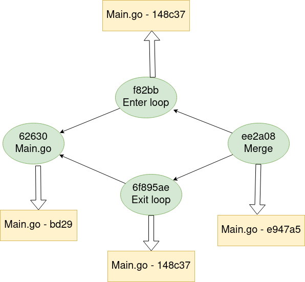

# Git 101

---
layout: center
class: 'text-white'
---

## whoami ? 
<style type="text/css">
    img {
        width: 250px;
    }
</style>


1. Java/Linux/DB/whatever business needs dev
2. Open source enthusiast
3. <logos-Blogger/> **Blog** - https://strogiyotec.github.io/
4. <logos-git/> **Github** - https://github.com/strogiyotec
4. <logos-telegram/> **Telegram** - @Lollipopster

---
layout: center
class: 'text-white'
---
# What will be covered today?
1. Git filesystem
2. What are git Objects
    1. blob
    2. index
    3. tree
    4. commit
    5. branch
3. What is merge and rebase
---
layout: center
class: 'text-white'
---
# What won't be covered ? 
1. Git flow
2. Branching strategy

## Why ? 
**Because it's up to the company you will work for**

---
layout: center
class: 'text-white'
---


---
layout: center
class: 'text-white'
---

## Some history

Mailing lists do not work for kernel
---
layout: center
class: 'text-white'
---
# It all starts with blobs
```
git hash-object -w Main.java
```
`7f4e1ed98d0c0d3f8a80271b1e61cb91eeefb037`

What the hell is it ? 

---
layout: center
class: 'text-white'
---


---
layout: center
class: 'text-white'
---
<style type="text/css">
    img {
        width: 50%;
        color: red;
    }
</style>

---
layout: center
class: 'text-white'
---
1. `7f` - directory
2. `4e1ed98d0c0d3f8a80271b1e61cb91eeefb037` - filename

(but Why ? )

---
layout: center
class: 'text-white'
---
## What is inside ? Ugly ha ? 
`vim 7f/4e1ed98d0c0d3f8a80271b1e61cb91eeefb037`
<style type="text/css">
    img {
        width: 400px;
    }
</style>


---
layout: center
class: 'text-white'
---
## Let's parse it in Python( Why not Java? 🤔 )
```python
import zlib  # A compression / decompression library

filename = '.git/objects/7f/4e1ed98d0c0d3f8a80271b1e61cb91eeefb037'

compressed_contents = open(filename, 'rb').read()

decompressed_contents = zlib.decompress(compressed_contents)
print(decompressed_contents)

```
---
layout: center
class: 'text-white'
---
<style type="text/css">
    img {
        width: 500px;
    }
</style>
[](https://asciinema.org/a/Kkj2dLRJ3lGk68orI5qe3VCfl)
---
layout: center
class: 'text-white'
---
# Let's write encoder now
```go
    data = read("Main.java")
	header := header(data, objType)// header is "object_type(blob) content_length null"
	result := append(header, data...)//append data to header
	hash, err := GenerateHash(result)//generate SHA1 hash - 7f4e1ed98d0c0d3f8a80271b1e61cb91eeefb037
    compressed :=zlib.Compress(result)
    write_to_file(
        hash,//file name
        compressed //content
    )

```


---
layout: center
class: 'text-white'
---
# Can I avoid writing my own Parser ? Hhhh... You are boring
`git cat-file -p 7f4e1ed98d0c0d3f8a80271b1e61cb91eeefb037`

---
layout: center
class: 'text-white'
---
<style type="text/css">
    img {
        width: 400px;
    }
</style>
Each time you call `git add` it creates a new file in `objects` folder

> ! Important , blob files DO NOT contain information about original file name. Who does then ? 

---
layout: center
class: 'text-white'
---
## Meet index file(staging area)
But first let's stage some files
```
git update-index --add --cacheinfo 100644 \
7f4e1ed98d0c0d3f8a80271b1e61cb91eeefb037 Main.java
```
1. 100644 - means regular text file
2. 7f4e1ed98d0c0d3f8a80271b1e61cb91eeefb037 - Hash
3. Main.java file name

Now try `git status`
```
Changes to be committed:
  (use "git rm --cached <file>..." to unstage)
        new file:   Main.java

```
---
layout: center
class: 'text-white'
---
[](https://asciinema.org/a/5EWI0GaWZB4LxdzykMlBR3800)
---
layout: center
class: 'text-white'
---


---
layout: center
class: 'text-white'
---
## What is inside of the index file ? 
```
> git ls-files --stage
100644 7f4e1ed98d0c0d3f8a80271b1e61cb91eeefb037 0       Main.java
```
1. 100644 - file type (text file)
2. 7f4e1ed98d0c0d3f8a80271b1e61cb91eeefb037 - SHA-1 has
3. 0 - stage numbers(usefull for merge conflicts)
4. Main.java - file name

---
layout: center
class: 'text-white'
---
# Big picture
1. All your files are compressed and stored in **objects** folder
2. Index file contains name of the file and corresponding hash

But what If I change `Main.java` and add it again to index file ? It will override previous entry

---
layout: center
class: 'text-white'
---
[](https://asciinema.org/a/4ArtL7UHX6ZZah3ckbq4gNzi6)
---
layout: center
class: 'text-white'
---
## Meet tree objects(snapshot of index file)

`git write-tree` will create a new tree object<br>
You can verify it using `git-cat` mentioned above

---
layout: center
class: 'text-white'
---
[](https://asciinema.org/a/osJJUrM7whZL1cv3SNBU1C3UU)
---
layout: center
class: 'text-white'
---


---
layout: center
class: 'text-white'
---
# Meet a commit object
Motivation. We have a list of blobs saved in tree object. But there is no information such as
1. Who is an author ? 
2. When tree object was created ?
3. Why it was created ?

---
layout: center
class: 'text-white'
---
## Let's create a commit object(as always, it's stored inside objects folder )
` git commit-tree -m 'I created Main.java' c49ca09403970a3fee23aefefd229fdf07fd58b9`

Let's see the content
```
> git cat-file -p bdcbd425c75c1b96da83e7a30f6188d4ecdb2bac
tree c49ca09403970a3fee23aefefd229fdf07fd58b9
author strogiyotec <almas337519@gmail.com> 1633823156 -0700 
committer strogiyotec <almas337519@gmail.com> 1633823156 -0700

I created Main.java

```
1. Tree hash
2. author - with time
3. committer with time
4. Message

---
layout: center
class: 'text-white'
---
[](https://asciinema.org/a/1vL8kEO0UocoGyhVpctqjVQDd)
---
layout: center
class: 'text-white'
---
## Why do we need author and committer ? 

> You can be an author but I am the one who commit your changes to main repository


---
layout: center
class: 'text-white'
---
## I need to track both versions of Main.java

### Commit object can have a parent

---
layout: center
class: 'text-white'
---

[](https://asciinema.org/a/tyxCbqE758D0mZ5KyVCOzvqcZ)


---
layout: center
class: 'text-white'
---
## Direct acyclic graph(DAG)

---
layout: center
class: 'text-white'
---
## Hey Almas can you checkout my commit<br> with a hash `asdsadasdwssdfsd`

#### asds... what ? 

---
layout: center
class: 'text-white'
---

## Meet branches


---
layout: center
class: 'text-white'
---
# Let's create a branch that points to the last commit(reversed order)

---
layout: center
class: 'text-white'
---
[](https://asciinema.org/a/RLURJh70at914swaaXv7yMIpI)

---
layout: center
class: 'text-white'
---
`git update-ref refs/heads/reverse 639...`

## Branch is 
1. Just a file inside of `.git/refs/heads/` folder
2. The content of a file is just a commit's hash

---
layout: center
class: 'text-white'
---

# The HEAD
## The question now is, when you run git branch reverse, how does Git know the SHA-1 of the last commit? The answer is the HEAD file

---
layout: center
class: 'text-white'
---
[](https://asciinema.org/a/CMozn1fc3SzRTdljOpDRHjlM4)

---
layout: center
class: 'text-white'
---
## Diff and Restore
[](https://asciinema.org/a/Qnof4hXbFn8ICgtMdsS7C00QW)

---
layout: center
class: 'text-white'
---

## Let's talk about merges
[](https://asciinema.org/a/DdC929IhUVOvryE2fzKgcK6sm)

---
layout: center
class: 'text-white'
---


---
layout: center
class: 'text-white'
---


---
layout: center
class: 'text-white'
---
## git log is a little bit confusing
[](https://asciinema.org/a/5TOM6JmErSGhb7Vb6GeHLfqFu)

---
layout: center
class: 'text-white'
---
## Conflicts

<style type="text/css">
    img {
        width: 250px;
    }
</style>


---
layout: center
class: 'text-white'
---

## Will we have conflict here ? 

[](https://asciinema.org/a/xP5yiVhmdUZ735WAa9ep5oQty)

---
layout: center
class: 'text-white'
---
## Git is smart



---
layout: center
class: 'text-white'
---

## When git doesn't know which line to use

[](https://asciinema.org/a/36WBFmZGG0dflRMt6TmizBiat)

---
layout: center
class: 'text-white'
---
# How to resolve ? 
## Just choose one of two versions and commit it


---
layout: center
class: 'text-white'
---

---
layout: center
class: 'text-white'
---
[](https://asciinema.org/a/XGEAOqly9CVIQjsoCxwwXkO01)

---
layout: center
class: 'text-white'
---
## When merge can make life complicated


---
layout: center
class: 'text-white'
---
# Meet Rebase
[](https://asciinema.org/a/rAw2D0E6pUVs5e6ceI7kTOGT0)

---
layout: center
class: 'text-white'
---
## How Merge would look like


---
layout: center
class: 'text-white'
---


---
layout: center
class: 'text-white'
---


---
layout: center
class: 'text-white'
---


---
layout: center
class: 'text-white'
---
> What I cannot create, I do not understand

(Richard Feynman)
## Meet [dzhigit](https://github.com/strogiyotec/dzhigit)


---
layout: center
class: 'text-white'
---
# And Remember, Do not trust me
## I Know nothing

